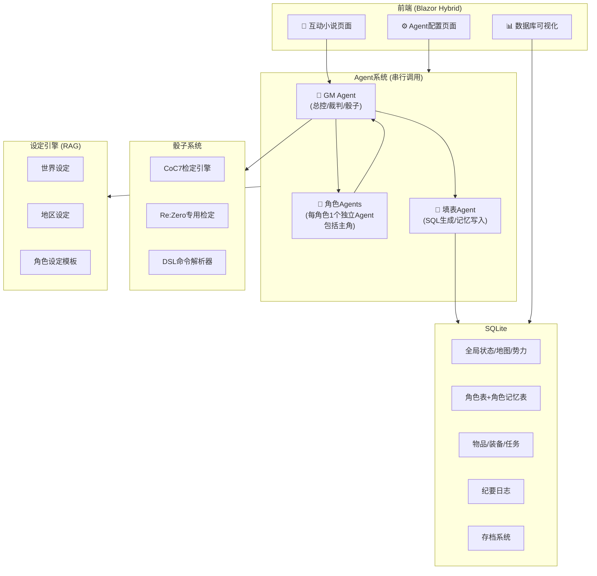
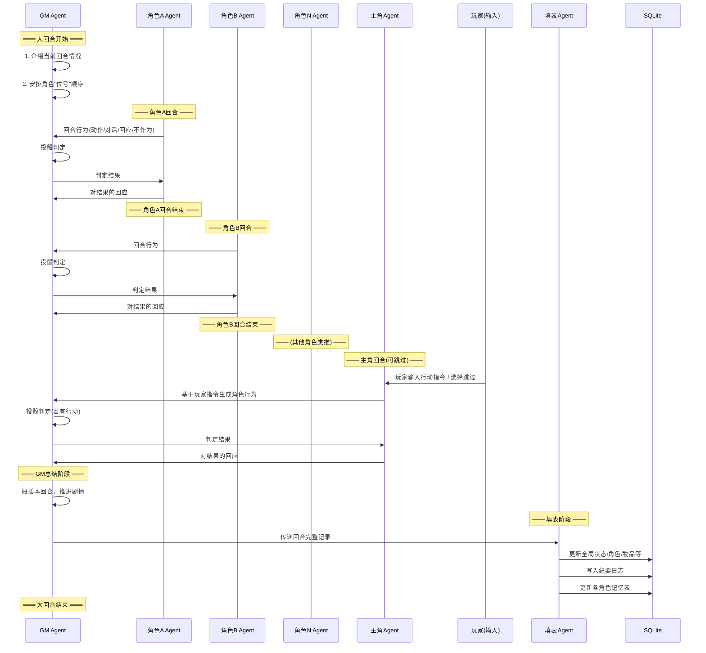

# Re:Zero AI Agent RPG 系统 — 实施计划 v2

## 核心变更 (vs v1)

- ✅ 每个角色一个专属Agent（1:1映射）
- ✅ 删除执笔者Agent → 新增填表Agent
- ✅ GM为幕后总控者
- ✅ 桌游回合制机制
- ✅ 删除check_suggestions表
- ✅ 角色独立记忆表
- ✅ 存档系统（死亡回归数据库回滚）

---

## 技术选型

| 层级 | 技术 | 理由 |
|------|------|------|
| **框架** | .NET 8 MAUI Blazor Hybrid | C#跨平台Windows→Android，HTML渲染互动小说 |
| **数据库** | SQLite + EF Core | 轻量嵌入，兼容骰子表格DDL |
| **AI通信** | HttpClient + SSE | OpenAI兼容格式（Google AI Studio / DeepSeek） |
| **RAG** | 关键词触发动态注入 | 2.8MB设定按需加载，复刻BlackTea的key机制 |

---

## 系统架构



---

## 回合制机制

### 概念定义

| 概念 | 定义 |
|------|------|
| **大回合** | 一次完整的游戏循环，包含所有角色回合 + 玩家回合 + GM总结 |
| **角色回合** | 单个角色Agent的个人行动阶段 |
| **位号** | GM分配的角色行动顺序 |

### 大回合流程



### GM位号分配逻辑

GM根据以下因素决定位号：
- **场景在场角色**（所有在场角色Agent，包括主角）
- **剧情紧急度**（战斗中敏捷高者先行，日常场景按叙事需要）
- **角色状态**（受伤/被控制的角色可能跳过）
- 主角Agent**固定最后行动**（收集所有信息后，接收玩家输入再行动）

---

## Agent详细设计

### GM Agent

| 项目 | 说明 |
|------|------|
| **角色** | 幕后总控、规则裁判、世界推动者 |
| **输入** | 当前世界状态(DB)、设定(RAG)、角色输出、玩家输入 |
| **输出** | 回合开场白、位号安排、检定指令、判定结果、回合总结、剧情推进 |
| **特殊职责** | 调用骰子系统、决定NPC行为倾向、控制剧情节奏、触发死亡回归 |

### 角色Agent (每角色1个，主角也是角色Agent)

| 项目 | 说明 |
|------|------|
| **角色** | 扮演一个特定角色，保持角色一致性 |
| **System Prompt** | 该角色的完整设定 + 角色记忆 + 当前状态 |
| **输入** | GM的回合情况描述、其他角色的行为(上文)、检定结果 |
| **输出** | 该角色的动作、对话、对他人行为的回应、内心活动 |
| **记忆** | 独立的`character_memory`表记录该角色视角的事件 |
| **主角特殊** | 主角Agent在行动前接收玩家输入作为行动指令，其余流程与NPC角色Agent一致 |

### 填表Agent

| 项目 | 说明 |
|------|------|
| **角色** | 将回合记录转化为SQL语句，更新数据库 |
| **输入** | 大回合完整文本记录、当前DB状态 |
| **输出** | 一批SQL UPDATE/INSERT语句 |
| **更新范围** | global_state、world_map、角色表、物品、任务、纪要、角色记忆 |

---

## 数据库设计

### 表结构总览 (11张表)

| 表名 | 来源 | 变更说明 |
|------|------|----------|
| `global_state` | 骰子表格 | +`current_chapter`列，Re:Zero历法 |
| `world_map_points` | 骰子表格 | 预填Re:Zero地点 |
| `map_elements` | 骰子表格 | 无变更 |
| `factions` | 骰子表格 | 预填王选阵营、魔女教等 |
| `protagonist_info` | 骰子表格 | 适配Re:Zero属性 |
| `important_npc` | 骰子表格 | +`character_memory`字段或关联表 |
| `inventory` | 骰子表格 | 无变更 |
| `equipment` | 骰子表格 | 无变更 |
| `quests` | 骰子表格 | 无变更 |
| `chronicle` | 骰子表格 | 无变更 |
| ~~`check_suggestions`~~ | ~~删除~~ | 由GM直接判断检定 |

### 新增表

```sql
-- 角色记忆表（每个角色Agent的私有记忆）
CREATE TABLE character_memory (
  row_id INTEGER PRIMARY KEY,
  character_name TEXT NOT NULL,           -- 关联important_npc.name
  round_index TEXT NOT NULL,              -- 对应大回合编号
  memory_text TEXT NOT NULL CHECK(LENGTH(memory_text) <= 400), -- 该角色视角的记忆
  emotional_state TEXT,                   -- 记忆时的情绪状态
  created_at TEXT NOT NULL                -- 记录时间
);

-- 死亡回归存档表
CREATE TABLE save_points (
  save_id INTEGER PRIMARY KEY,
  chapter INT NOT NULL,
  trigger_reason TEXT NOT NULL,           -- 死因/触发原因
  global_state_snapshot TEXT NOT NULL,    -- JSON快照
  protagonist_snapshot TEXT NOT NULL,
  npc_snapshot TEXT NOT NULL,
  inventory_snapshot TEXT NOT NULL,
  equipment_snapshot TEXT NOT NULL,
  quest_snapshot TEXT NOT NULL,
  created_at TEXT NOT NULL
);

-- 死亡回归日志
CREATE TABLE death_return_log (
  log_id INTEGER PRIMARY KEY,
  loop_count INTEGER NOT NULL,            -- 第几次循环
  death_cause TEXT NOT NULL,              -- 死因
  miasma_level INTEGER NOT NULL DEFAULT 0,-- 瘴气等级(0-100)
  save_point_id INTEGER REFERENCES save_points(save_id),
  chronicle_index TEXT,                   -- 对应纪要编号
  created_at TEXT NOT NULL
);

-- Agent配置表
CREATE TABLE agent_config (
  config_id INTEGER PRIMARY KEY,
  agent_type TEXT NOT NULL,               -- GM/Character/Form
  agent_name TEXT NOT NULL UNIQUE,        -- 如"GM"/"爱蜜莉雅"/"填表Agent"
  api_endpoint TEXT NOT NULL,
  api_key TEXT NOT NULL,
  model_name TEXT NOT NULL,
  temperature REAL DEFAULT 0.7,
  max_tokens INTEGER DEFAULT 4096,
  system_prompt TEXT,
  enabled INTEGER DEFAULT 1
);

-- 主角模板表（支持多主角模板）
CREATE TABLE protagonist_templates (
  template_id INTEGER PRIMARY KEY,
  template_name TEXT NOT NULL UNIQUE,     -- 如"菜月昴"/"自定义角色"
  includes_subaru INTEGER DEFAULT 1,      -- 是否包含昴作为NPC
  base_data TEXT NOT NULL,                -- JSON格式的protagonist_info初始数据
  is_default INTEGER DEFAULT 0
);
```

### 角色记忆机制

每个角色Agent在大回合结束时，由填表Agent为其写入一条记忆：

```
角色Agent System Prompt构成:
┌─────────────────────────────┐
│ 1. 角色基础设定 (RAG加载)     │
│ 2. 当前状态 (important_npc)   │
│ 3. 近期记忆 (character_memory │
│    最近N条, 按时间倒序)        │
│ 4. 当前回合上下文             │
└─────────────────────────────┘
```

---

## Re:Zero 专用检定规则方案

### 基础检定 (沿用CoC7 1d100)

```
属性值范围: [5, 95]
判定: 1d100 ≤ 属性值 → 成功
  大成功: 骰值=1
  极难成功: 骰值 ≤ 属性值/5
  困难成功: 骰值 ≤ 属性值/2  
  普通成功: 骰值 ≤ 属性值
  失败: 骰值 > 属性值
  大失败: 骰值=100 (属性<50时96-100)
```

### Re:Zero 魔法战斗检定

#### 魔法施法检定
```
检定属性: 对应元素亲和度 (如 火魔法:75)
难度修正:
  基础魔法(无前缀): 普通难度
  El级: 困难(-10)
  Ul级: 极难(-20)  
  Al级: 极难(-30)
  
附加判定 - 门消耗检定:
  施法成功后追加 1d100 vs 门耐久度
  失败 → 门损伤等级+1
  门损伤等级: 正常(0) → 轻微(1) → 中度(2) → 严重(3) → 永久损坏(4)
  每级损伤: 后续所有魔法检定-10
```

#### 精灵术检定
```
精灵术师使用精灵施法时:
  检定属性: 精灵契约度 (如 帕克契约:90)
  优势: 多元素同时施法无额外惩罚
  限制: 精灵活跃时间外自动失败 (帕克: 9:00-17:00)
```

#### 权能检定

| 权能 | 检定方式 | 特殊规则 |
|------|----------|----------|
| **死亡回归** | 无需检定 | 自动触发，但追加瘴气累积检定 |
| **Invisible Providence** | 检定 怠惰权能:XX | 成功也受反噬(1d20生命值损失) |
| **Cor Leonis** | 检定 强欲权能:XX | 转移负担量=成功等级 |
| **不可视之手(敌方)** | 对抗 感知 vs 怠惰权能 | 看不见需先通过感知检定 |
| **狮子的心脏** | 必成(有妻子时) | 妻子数量决定持续时间 |

#### 瘴气累积检定
```
触发: 每次死亡回归后
检定: 1d100 vs (100 - 当前瘴气等级)
  成功: 瘴气等级+5
  失败: 瘴气等级+15
  大失败: 瘴气等级+30

瘴气效果:
  0-20: 无明显效果
  21-40: 敏感者(雷姆/加菲尔)察觉异样
  41-60: 吸引低级魔兽，NPC产生不安
  61-80: 吸引大型魔兽，多数NPC敌意
  81-100: 极度危险，可能触发特殊事件
```

#### 加护检定
```
加护是被动能力，触发时自动检定:
  检定属性: 加护等级 (如 剑圣加护:95)
  成功: 加护生效
  对抗权能时: 加护自动失败 (权能 > 加护)
```

#### 魔法对抗检定
```
格式: 对抗 <施法者> <元素魔法> vs <防御者> <元素魔法/体质>
规则: 
  相克元素: 攻方+10 (如 火vs风)
  同属性: 纯数值对抗
  非魔法防御: 用体质/敏捷闪避
```

---

## 存档系统 (死亡回归)

### 存档点创建
- **每个大回合结束时自动创建存档**
- 将所有表的当前状态序列化为JSON快照存入`save_points`
- 玩家可在前端**手动删除存档**（保留最近一个不可删除）

### 死亡回归触发
```
1. GM判定主角死亡
2. 写入death_return_log(死因/瘴气)
3. 执行瘴气累积检定
4. 从save_points恢复最近存档
5. 回滚所有游戏状态表
6. 保留: chronicle(纪要)、death_return_log、主角的character_memory
7. 清除: 所有非主角的character_memory(全部删除)
8. GM以新回合开始
```

> [!IMPORTANT]
> **主角完整保留记忆**，其他所有角色记忆全部删除（回到存档点状态）。
> 主角Agent可以利用这些记忆做出不同选择，但不能向其他角色解释死亡回归。

---

## 主角模板系统

### 默认模板: 菜月昴
- 预填`protagonist_info`所有字段
- 全部Re:Zero NPC正常加载
- 章节起点可选

### 自定义模板
- 玩家填写基础信息 → 生成`protagonist_info`
- 可选是否存在菜月昴（勾选后昴变为NPC加入`important_npc`）
- 自定义起始位置/章节/初始关系

---

## 项目结构

```
Re0Agent/
├── Re0Agent.sln
├── src/
│   ├── Re0Agent.Core/                # 核心业务逻辑
│   │   ├── Models/
│   │   │   ├── GameRound.cs          # 大回合/角色回合模型
│   │   │   ├── CharacterAgent.cs     # 角色Agent模型
│   │   │   └── DiceResult.cs         # 检定结果模型
│   │   ├── Services/
│   │   │   ├── Agent/
│   │   │   │   ├── GMAgent.cs        # GM总控Agent
│   │   │   │   ├── CharacterAgentService.cs  # 角色Agent管理(含主角)
│   │   │   │   ├── FormAgent.cs      # 填表Agent
│   │   │   │   └── AgentOrchestrator.cs      # 串行编排器
│   │   │   ├── Dice/
│   │   │   │   ├── CoCEngine.cs      # CoC7引擎
│   │   │   │   ├── ReZeroRules.cs    # Re:Zero专用规则
│   │   │   │   └── DslParser.cs      # DSL解析
│   │   │   ├── Settings/
│   │   │   │   ├── RagLoader.cs      # RAG设定加载器
│   │   │   │   └── ChapterVariant.cs # 章节变体
│   │   │   ├── Database/
│   │   │   │   ├── SaveSystem.cs     # 存档/回滚
│   │   │   │   └── DbContext.cs
│   │   │   └── Import/
│   │   │       └── SillyTavernImporter.cs  # BlackTea导入
│   │   └── Interfaces/
│   ├── Re0Agent.App/                 # MAUI Blazor应用
│   │   ├── Components/
│   │   │   ├── Novel/                # 互动小说UI
│   │   │   ├── Config/               # Agent配置UI
│   │   │   └── Database/             # DB可视化UI
│   │   ├── wwwroot/
│   │   └── Platforms/
│   │       ├── Windows/
│   │       └── Android/
│   └── Re0Agent.Tests/
├── data/
│   ├── settings/                     # Re:Zero JSON设定
│   ├── templates/                    # 主角模板
│   └── re0agent.db                   # SQLite
└── docs/
```

---

## 开发阶段

### Phase 1: 基础框架 (2-3周)
- MAUI Blazor Hybrid搭建
- SQLite全部DDL建表
- 数据模型定义

### Phase 2: Agent系统 (3-4周)  
- LLM API通信层 (Google AI Studio / DeepSeek / OpenAI兼容)
- GM Agent
- 角色Agent框架 + 角色记忆系统
- 填表Agent
- 串行编排器（大回合流程）

### Phase 3: 设定与骰子 (2周)
- RAG设定引擎 + BlackTea导入器
- CoC7引擎 + Re:Zero专用检定
- 章节变体系统

### Phase 4: 存档与模板 (1周)
- 死亡回归存档/回滚
- 主角模板系统

### Phase 5: 前端重构与视觉美化 (3周)

根据 Re:Zero 主题设计**深色复古魔法风**，以**暗棕色（Dark Brown）**为主基调，融合魔导书、羊皮纸与古铜质感，设计动态沉浸式的前端界面。

#### 1. 全局设计规范 (Global Design Tokens)

- **配色体系 (Color Palette)**
  - `背景色 (--bg-base)`: `#1a0f0a` （深邃暗黑棕，模拟夜晚木桌/古老档案馆）
  - `容器色 (--bg-surface)`: `#2b1b12` （暗皮革棕，模拟皮质魔导书/木质面板）
  - `面板色 (--bg-panel)`: `#3d281d` （温暖暗棕，用于承载文字、表格、输入框）
  - `纸张色 (--bg-parchment)`: `#f4eae1` （羊皮纸浅白，用于小说主文本，高对比度护眼）
  - `复古金 (--color-gold)`: `#d4af37` （哑光古铜金，用于边框、分割线、关键标签）
  - `魔法金 (--color-gold-glow)`: `#ffd700` （亮金色，用于按钮悬浮、输入框聚焦、成功特效）
  - `血月红 (--color-crimson)`: `#8b0000` （深血红色，用于“死亡回归”、危险状态、大失败）
  - `魔女紫 (--color-purple)`: `#4a154b` （嫉妒魔女瘴气紫，用于魔兽出现、瘴气状态栏）
  - `主文字 (--color-text-primary)`: `#ebdcd0` （暖白，易读）
  - `次文字 (--color-text-secondary)`: `#a68d7d` （哑光棕，用于注释、表头）

- **字体体系 (Typography)**
  - `标题字体`: `'Cinzel', 'Georgia', 'Times New Roman', serif` （复古衬线，史诗感）
  - `正文语录`: `'Palatino', 'Georgia', serif` （古典衬线，故事感）
  - `系统字`: `'system-ui', sans-serif` （高可读性）

- **质感与动效 (Effects & Animations)**
  - `金属边框`: 双线古铜金边框 （`border: 3px double var(--color-gold)`）
  - `悬浮阴影`: 软阴影与微光结合 （`box-shadow: 0 4px 15px rgba(0, 0, 0, 0.6), inset 0 0 10px rgba(212, 175, 55, 0.1)`）
  - `渐入过渡`: 所有文本与组件生成时具备 `.fade-in` 动画。

#### 2. 页面详细设计方案

- **📖 互动小说页面 (`Home.razor`)**
  - **魔导书双栏/居中布局**：主体设计成一本展开的“命运之书”。
    - **顶部状态栏**：
      - 左侧：当前章节（古铜金质感卷轴）。
      - 中间：死亡回归循环次数（血红色徽章 `Loop X`）。
      - 右侧：瘴气值进度条（带有紫色雾气波动 CSS 粒子效果，若值升高则雾气变浓）。
    - **编年史日志 (Chronicle Log)**：
      - **GM旁白**：居中，古金色文字，斜体，带有精致的星芒或羽毛笔图标，表现世界线的变动。
      - **角色对话/行为**：
        - 非玩家角色 (NPC)：左侧头像，灰色/暗棕色皮质底色气泡，文字使用浅乳白色。
        - 玩家角色 (PC/菜月昴)：右侧头像，古铜金或暗红色边框气泡，突显主视角。
        - 独白/动作描述：使用小一号的灰色倾斜字体，与对话区隔。
    - **检定卡片 (Dice Roll Card)**：
      - 投骰时，GM下方会弹出一个“检定卡片”，印有黑底烫金的魔法阵。
      - 动态展现骰值变化，根据检定结果呈现不同色调：
        - `大成功/极难成功`：金色光芒粒子效果。
        - `普通成功`：柔和的绿色/金色光。
        - `失败`：暗沉灰色。
        - `大失败/死亡回归`：血色碎裂效果，伴有轻微震动。
    - **行动输入面板 (Ink Scroll)**：
      - 玩家的 textarea 模拟成羊皮卷轴底色（`#ebdcd0` 纸张底色，黑墨水文字）。
      - 按钮采用“印章”或“青铜铭牌”质感。支持“跳过回合”（进入完全旁观模式）。

- **⚙️ Agent 配置页面 (`AgentConfig.razor`)**
  - **“契约法典”风格**。
  - 左侧为 Agent 目录（GM Agent、填表 Agent、角色 Agent 列表），采用魔导书页签样式。
  - 右侧为配置面板，包含 API Endpoint、Model Name、Temperature 及 System Prompt 文本域。
  - 输入框全部采用深褐色背景、古铜色边框，聚焦时散发魔法金微光（`box-shadow: 0 0 8px var(--color-gold-glow)`）。

- **📊 数据库可视化 (`DatabaseView.razor`)**
  - **“旧档案馆”风格**。
  - 数据表（如 `ProtagonistInfo`、`ImportantNpc`、`CharacterMemory`）呈现在羊皮纸标签页 (Tab) 中。
  - 表格采用深褐色木纹理背景，边框为暗金细线，去除 Bootstrap 的现代扁平感。
  - 存档条目列表：
    - 每一个存档显示为“命运锚点”，最新存档以金色徽章标出。
    - 每一行提供“回滚到此”、“删除”按钮（操作时弹出复古蜡封样式的确认框）。
  - **手动触发死亡回归**按钮：设计成血红色的“魔女之手”或“破碎的心脏”图标，点击时触发死亡回归仪式。

#### 3. 魔女眷顾：死亡回归转场特效 (Death Return Glitch Transition)

- 当 GM Agent 触发死亡回归或玩家手动回滚时：
  1. 页面全部元素瞬间静止，并添加灰度滤镜 (`filter: grayscale(100%)`)。
  2. 屏幕边缘溢出紫色迷雾 (`box-shadow: inset 0 0 50px rgba(74, 21, 75, 0.8)`)。
  3. 伴随剧烈画面晃动（CSS抖动 `shake`）和红黑相间的信号干扰（Glitch 效果）。
  4. 居中淡入古体红色大字“死 亡 回 归”，并在 1.5 秒后随着紫光扩散淡出，页面重新刷新并加载回滚后的存档状态。

---

### Phase 6: 集成测试与多平台适配 (1-2周)

---

## 所有决策已确认 ✅

- ✅ 魔法检定规则（门损伤+瘴气累积）
- ✅ 串行调用，回合耗时30-60秒可接受
- ✅ 每回合自动存档 + 用户可删除存档
- ✅ 玩家可跳过回合（旁观模式）
- ✅ 死亡回归：主角记忆完整保留，其他角色记忆全删

**等待用户批准后开始Phase 1开发。**
